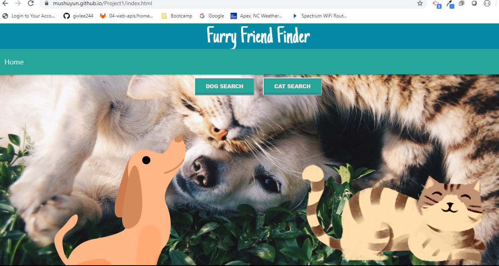
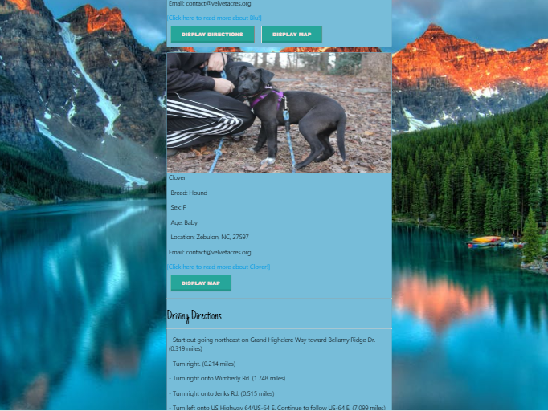
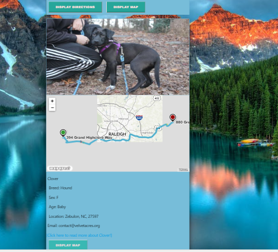

# Furry Friend Finder

## Table of Contents

* [Description](#description)
* [Usage](#usage)
* [Screenshots](#screenshots)
* [Built With](#built-with)
* [Contributing](#contributing)

## Description
An app that allows you to search for adoptable dogs and cats in your area and displays information as well as maps and directions to find these needy animals. 

 * This full-stack application is deployed on Heroku : https://gwlee244.github.io/Furry-Friend-Finder/

  
  ## Usage
  
  * To get started, fill out the input fields for animal breed, gender and zip code to narrow your pet search. When you click 'submit', our app will make a call to the __PetFinder API__ to show adoptable animals nearby based on that user's zipcode. We also make an api call to __TheCatapi__ and __TheDogapi__ to show specific pictures and information for whatever breed you chose. If you see an animal you like, click the button that says 'Display Map' or 'Display Directions' and a call will be made to the __Mapquest Api__ to show a map or driving directions to find that animal.
  
  ## Screenshots

   ## Built With  

* **HTML** 
* **CSS** 
* **Javascript** 
* **Jquery** 
* **Materialize**
* **Petfinder API**
* **TheDog API**
* **TheCat API**
* **Mapquest API**

## Contributing

*  Our team members are __Alex Coulter, Shuyun Mu (Sue), Gene Lee, and Diantai Johnson.__

